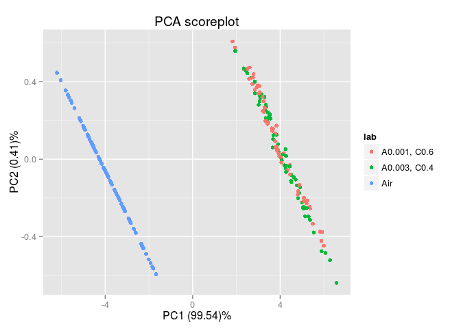
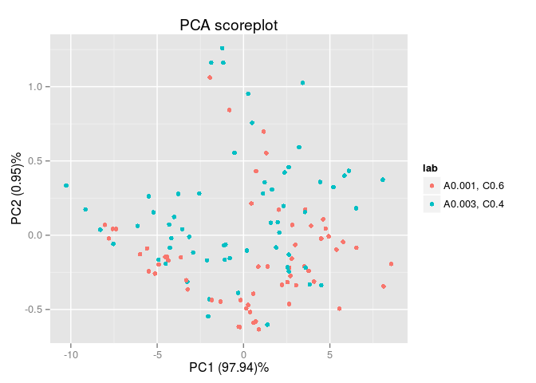
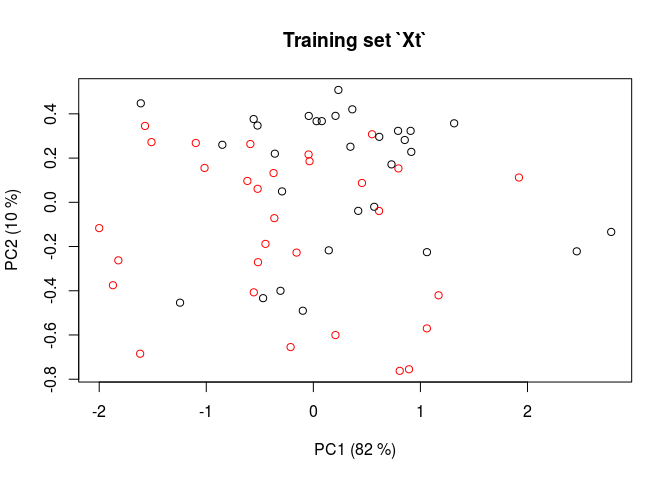
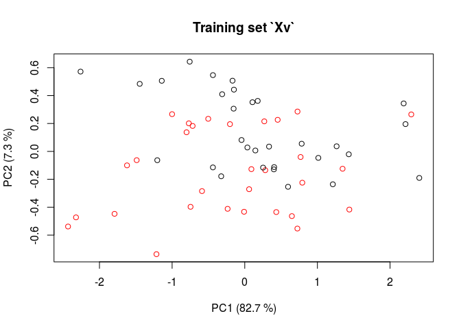
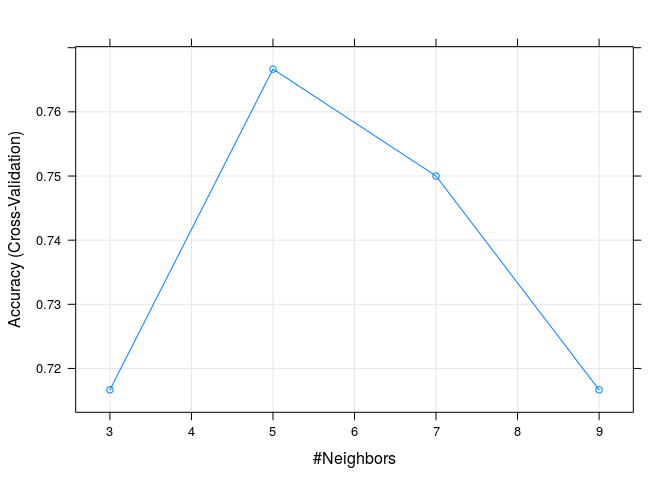

Libraries
---------

``` r
library(chemosensors)
library(caret)
```

``` r
if(packageVersion("chemosensors") < "0.7.9") {
  warning("chemosensors >= 0.7.9 is preferred")
}
```

    ## Warning: chemosensors >= 0.7.9 is preferred

Parameters
----------

``` r
nT <- 30
nV <- 30

cores <- 2
```

Notes
-----

-   The use of `seed` command is suggested for reproducibility of the results.
    -   `set.seed(123)` command in the code block of data generation (simulation).
    -   `set.seed(1)` command in the code block of fitting the models `fit1`, etc (the process of model fitting involves some resampling procedures)
-   Selection of the best tunning parameters in `caret` package might be controled by `selectionFunction` variable in `trControl` argument.

Generate data
-------------

``` r
set.seed(123)

set <- c("A 0.001, C 0.6", "A 0.003, C 0.4")

sc <- Scenario(T = set, nT = nT, V = set, nV = nV, randomize = TRUE)

### not working code, because concentration in `conc` and `cf` were generated and randomized
# independently (`randomize = TRUE` in scenario)
# solution: generate concentrations once in `cf` and read them out from `cf` to `conc`
# (`cf` is prefered, since it contains training/validation labels from scenario object `sc`
#conc <- getConc(sc)
#cf <- sdata.frame(sc)

### working code for `packageVersion("chemosensors") >= "0.7.9"`
#cf <- sdata.frame(sc)
#conc <- getConc(sc, cf = cf)

### working code for `packageVersion("chemosensors") < "0.7.9"`
cf <- sdata.frame(sc)
conc <- subset(cf, select = gnames(sc))

sa <- SensorArray(num = 1:17, csd = 1, ssd = 1, dsd = 1)
sdata <- predict(sa, conc = conc, cores = cores)
```

    ##  * Started computing in parallel on 2 CPU cores (if available) (SensorModel::sdataModel).
    ##  * Finished computing in parallel.

``` r
df <- sdata.frame(sa, cf = cf, sdata = sdata, feature = "step")
```

Plot all the data
-----------------

``` r
plotPCA(sa, conc = conc, sdata = sdata)
```



``` r
plotPCA(sa, conc = conc, sdata = sdata, air = FALSE)
```



Split data into two training and validation set
-----------------------------------------------

``` r
Xt <- as.matrix(subset(df, set == "T", select = snames(sa)))
Xv <- as.matrix(subset(df, set == "V", select = snames(sa)))

lab <- subset(df, set == "T", "lab", drop = TRUE)
lab <- gsub(",| ", "", lab)
Yt <- as.factor(lab)

lab <- subset(df, set == "V", "lab", drop = TRUE)
lab <- gsub(",| ", "", lab)
Yv <- as.factor(lab)
```

Plot data in training/validation sets
-------------------------------------

``` r
scoreplot(prcomp(Xt), col = factor(Yt), main = "Training set `Xt`")
```



``` r
scoreplot(prcomp(Xv), col = factor(Yv), main = "Training set `Xv`")
```



Train the model
---------------

### Applied `best` rule

``` r
set.seed(1)
fit1 <- train(Xt, Yt, method = "knn", tuneGrid = data.frame(.k = c(3, 5, 7, 9)),
  trControl = trainControl(method = "cv", number = 10, repeats = 10),
  preProcess = c("center", "scale", "pca"))
```

``` r
fit1
```

    ## k-Nearest Neighbors 
    ## 
    ## 60 samples
    ## 17 predictors
    ##  2 classes: 'A0.001C0.6', 'A0.003C0.4' 
    ## 
    ## Pre-processing: centered, scaled, principal component signal extraction 
    ## Resampling: Cross-Validated (10 fold) 
    ## 
    ## Summary of sample sizes: 54, 54, 54, 54, 54, 54, ... 
    ## 
    ## Resampling results across tuning parameters:
    ## 
    ##   k  Accuracy  Kappa  Accuracy SD  Kappa SD
    ##   3  0.717     0.433  0.112        0.225   
    ##   5  0.767     0.533  0.179        0.358   
    ##   7  0.75      0.5    0.142        0.283   
    ##   9  0.717     0.433  0.158        0.316   
    ## 
    ## Accuracy was used to select the optimal model using  the largest value.
    ## The final value used for the model was k = 5.

``` r
plot(fit1)
```



### Applied `tolerance` rule

``` r
set.seed(1)
fit2 <- train(Xt, Yt, method = "knn", tuneGrid = data.frame(.k = c(3, 5, 7, 9)),
  trControl = trainControl(method = "cv", number = 10, repeats = 10,
    selectionFunction = "tolerance"),
  preProcess = c("center", "scale", "pca"))
```

``` r
fit2
```

    ## k-Nearest Neighbors 
    ## 
    ## 60 samples
    ## 17 predictors
    ##  2 classes: 'A0.001C0.6', 'A0.003C0.4' 
    ## 
    ## Pre-processing: centered, scaled, principal component signal extraction 
    ## Resampling: Cross-Validated (10 fold) 
    ## 
    ## Summary of sample sizes: 54, 54, 54, 54, 54, 54, ... 
    ## 
    ## Resampling results across tuning parameters:
    ## 
    ##   k  Accuracy  Kappa  Accuracy SD  Kappa SD
    ##   3  0.717     0.433  0.112        0.225   
    ##   5  0.767     0.533  0.179        0.358   
    ##   7  0.75      0.5    0.142        0.283   
    ##   9  0.717     0.433  0.158        0.316   
    ## 
    ## Accuracy was used to select the optimal model using  a tolerance rule.
    ## The final value used for the model was k = 5.

### Applied `oneSE` rule

``` r
set.seed(1)
fit3 <- train(Xt, Yt, method = "knn", tuneGrid = data.frame(.k = c(3, 5, 7, 9)),
  trControl = trainControl(method = "cv", number = 10, repeats = 10,
    selectionFunction = "oneSE"),
  preProcess = c("center", "scale", "pca"))
```

``` r
fit3
```

    ## k-Nearest Neighbors 
    ## 
    ## 60 samples
    ## 17 predictors
    ##  2 classes: 'A0.001C0.6', 'A0.003C0.4' 
    ## 
    ## Pre-processing: centered, scaled, principal component signal extraction 
    ## Resampling: Cross-Validated (10 fold) 
    ## 
    ## Summary of sample sizes: 54, 54, 54, 54, 54, 54, ... 
    ## 
    ## Resampling results across tuning parameters:
    ## 
    ##   k  Accuracy  Kappa  Accuracy SD  Kappa SD
    ##   3  0.717     0.433  0.112        0.225   
    ##   5  0.767     0.533  0.179        0.358   
    ##   7  0.75      0.5    0.142        0.283   
    ##   9  0.717     0.433  0.158        0.316   
    ## 
    ## Accuracy was used to select the optimal model using  the one SE rule.
    ## The final value used for the model was k = 9.

Check the prediction accuracy
-----------------------------

Training set:

``` r
table(predict(fit1, Xt), Yt)
```

    ##             Yt
    ##              A0.001C0.6 A0.003C0.4
    ##   A0.001C0.6         28         10
    ##   A0.003C0.4          2         20

Validation set:

``` r
table(predict(fit1, Xv), Yv)
```

    ##             Yv
    ##              A0.001C0.6 A0.003C0.4
    ##   A0.001C0.6         24         12
    ##   A0.003C0.4          6         18

Accuracy:

``` r
tab.t <- table(predict(fit1, Xt), Yt)
acc.t <- sum(diag(tab.t)) / sum(tab.t)
acc.t
```

    ## [1] 0.8

``` r
tab.v <- table(predict(fit1, Xv), Yv)
acc.v <- sum(diag(tab.v)) / sum(tab.v)
acc.v
```

    ## [1] 0.7

Note that the prediction accuracy in trainig set `acc.t` is different from that reported by the model `fit1`. The accuracy measures in `fit1` were evaluated with resampling.

R session info
--------------

``` r
sessionInfo()
```

    ## R version 3.0.2 (2013-09-25)
    ## Platform: x86_64-pc-linux-gnu (64-bit)
    ## 
    ## locale:
    ##  [1] LC_CTYPE=en_US.UTF-8       LC_NUMERIC=C              
    ##  [3] LC_TIME=en_US.UTF-8        LC_COLLATE=en_US.UTF-8    
    ##  [5] LC_MONETARY=en_US.UTF-8    LC_MESSAGES=en_US.UTF-8   
    ##  [7] LC_PAPER=en_US.UTF-8       LC_NAME=C                 
    ##  [9] LC_ADDRESS=C               LC_TELEPHONE=C            
    ## [11] LC_MEASUREMENT=en_US.UTF-8 LC_IDENTIFICATION=C       
    ## 
    ## attached base packages:
    ## [1] stats     graphics  grDevices utils     datasets  methods   base     
    ## 
    ## other attached packages:
    ##  [1] e1071_1.6-3        multicore_0.2      caret_6.0-30      
    ##  [4] lattice_0.20-29    chemosensors_0.7.7 ggplot2_1.0.0     
    ##  [7] reshape2_1.4       plyr_1.8.1         pls_2.4-3         
    ## [10] rmarkdown_0.4.2    knitr_1.7          devtools_1.4.1.99 
    ## 
    ## loaded via a namespace (and not attached):
    ##  [1] BradleyTerry2_1.0-5 brglm_0.5-9         car_2.0-20         
    ##  [4] class_7.3-9         codetools_0.2-8     colorspace_1.2-4   
    ##  [7] compiler_3.0.2      digest_0.6.4        evaluate_0.5.5     
    ## [10] foreach_1.4.2       formatR_1.0         grid_3.0.2         
    ## [13] gtable_0.1.2        gtools_3.4.1        htmltools_0.2.4    
    ## [16] httr_0.3            iterators_1.0.7     labeling_0.2       
    ## [19] LearnBayes_2.15     lme4_1.1-8          MASS_7.3-33        
    ## [22] Matrix_1.1-4        memoise_0.2.1       minqa_1.2.3        
    ## [25] munsell_0.4.2       nlme_3.1-113        nloptr_1.0.0       
    ## [28] nnet_7.3-7          parallel_3.0.2      proto_0.3-10       
    ## [31] quadprog_1.5-5      RColorBrewer_1.0-5  Rcpp_0.11.2        
    ## [34] RCurl_1.95-4.1      scales_0.2.4        splines_3.0.2      
    ## [37] stringr_0.6.2       tools_3.0.2         whisker_0.3-2      
    ## [40] yaml_2.1.13
