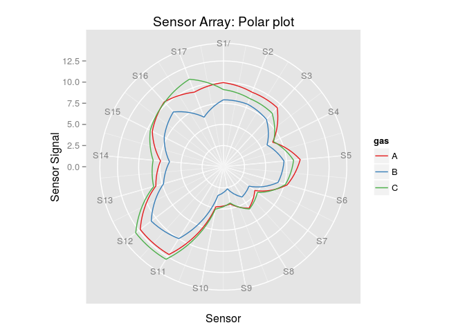
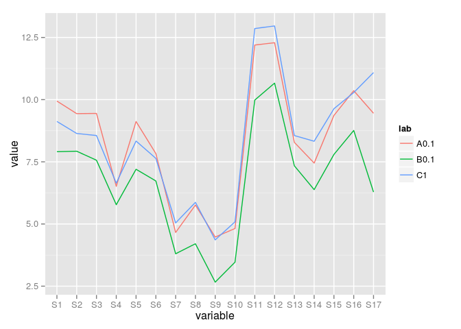
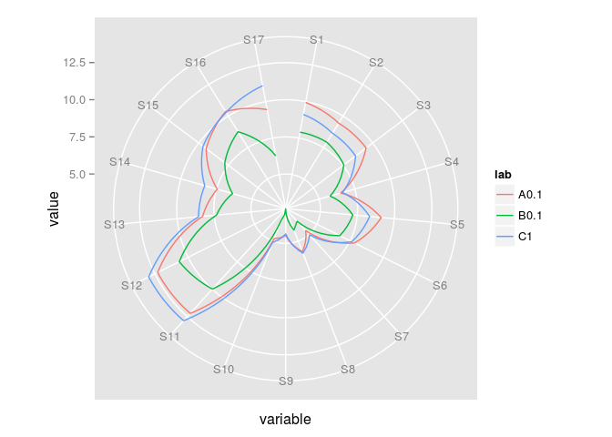
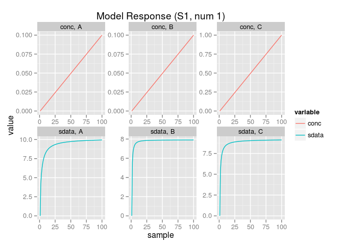
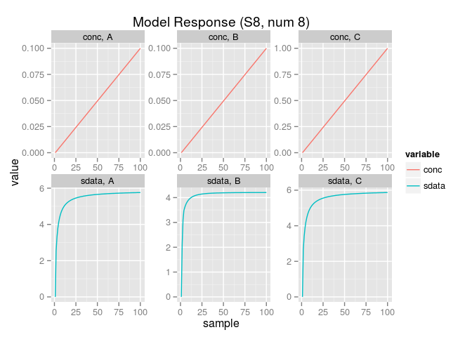
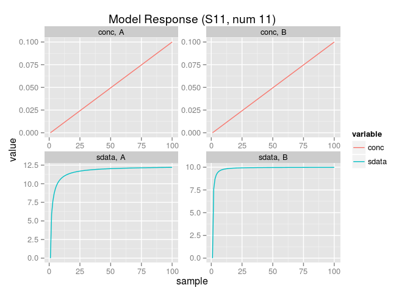
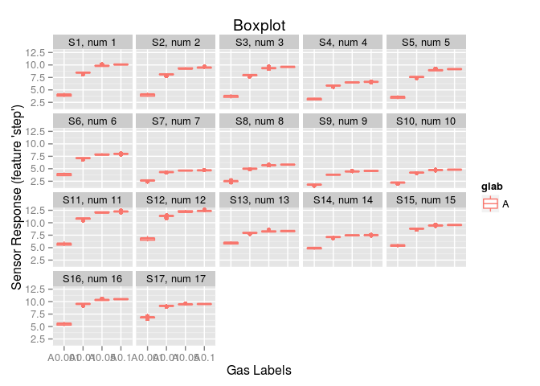
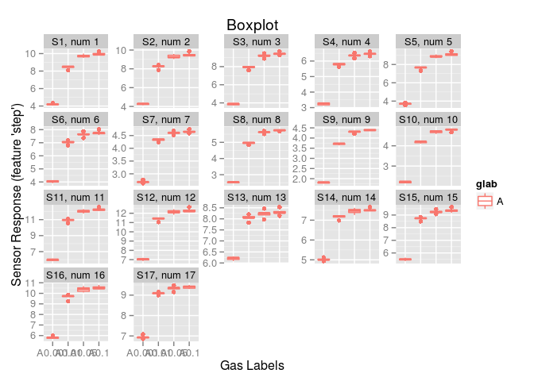

# Plot methods applied to `SensorArray` class
Andrey Ziyatdinov  
`r Sys.Date()`  


## Libraries


```r
library(chemosensors)
```

## Default plot method


```r
sa <- SensorArray(nsensors = 17)
plot(sa) # the same as `plotPolar(sa)`
```

 

The default plot method for `SensorArray` object is `plotPolar`.
The concentration values come from `concMax` method.


```r
concMax(sa)
```

```
## [1] 0.1 0.1 1.0
```

## Custom code to replicate polar plot


```r
set <- c("A", "B", "C")
sc <- Scenario(set)
conc <- getConc(sc)
conc
```

```
##     A   B C
## 1 0.0 0.0 0
## 2 0.1 0.0 0
## 3 0.0 0.0 0
## 4 0.0 0.1 0
## 5 0.0 0.0 0
## 6 0.0 0.0 1
```

Note that the values in `conc` concentration matrix are the same as output of `concMax` method.

Now let's get the sensor array `sa` response.
The noise has to be suppressed, in order to replicate the results of `plotPolar`.


```r
sa0 <- sa
nsd(sa0) <- 0
sdata <- predict(sa0, conc)
sdata
```

```
##            S1       S2       S3       S4       S5       S6       S7
## [1,] 0.000000 0.000000 0.000000 0.000000 0.000000 0.000000 0.000000
## [2,] 9.942770 9.437904 9.446131 6.514917 9.120964 7.832802 4.659713
## [3,] 0.000000 0.000000 0.000000 0.000000 0.000000 0.000000 0.000000
## [4,] 7.907237 7.926968 7.564267 5.776010 7.199949 6.730627 3.803335
## [5,] 0.000000 0.000000 0.000000 0.000000 0.000000 0.000000 0.000000
## [6,] 9.122651 8.639970 8.557138 6.642499 8.335194 7.640177 5.044040
##            S8       S9      S10       S11      S12      S13      S14
## [1,] 0.000000 0.000000 0.000000  0.000000  0.00000 0.000000 0.000000
## [2,] 5.761955 4.474961 4.818543 12.195856 12.28947 8.281243 7.449319
## [3,] 0.000000 0.000000 0.000000  0.000000  0.00000 0.000000 0.000000
## [4,] 4.204719 2.661934 3.465201  9.982335 10.66409 7.339417 6.382057
## [5,] 0.000000 0.000000 0.000000  0.000000  0.00000 0.000000 0.000000
## [6,] 5.870309 4.361591 5.086823 12.859634 12.96329 8.556153 8.327524
##           S15       S16       S17
## [1,] 0.000000  0.000000  0.000000
## [2,] 9.366851 10.360406  9.452602
## [3,] 0.000000  0.000000  0.000000
## [4,] 7.797245  8.760935  6.285187
## [5,] 0.000000  0.000000  0.000000
## [6,] 9.635068 10.283833 11.088651
```

Now we need to prepare a data.frame for plotting.


```r
df <- sdata.frame(sa, conc = conc, sdata = sdata, feature = "step")
df
```

```
##         S1       S2       S3       S4       S5       S6       S7       S8
## 2 9.942770 9.437904 9.446131 6.514917 9.120964 7.832802 4.659713 5.761955
## 4 7.907237 7.926968 7.564267 5.776010 7.199949 6.730627 3.803335 4.204719
## 6 9.122651 8.639970 8.557138 6.642499 8.335194 7.640177 5.044040 5.870309
##         S9      S10       S11      S12      S13      S14      S15
## 2 4.474961 4.818543 12.195856 12.28947 8.281243 7.449319 9.366851
## 4 2.661934 3.465201  9.982335 10.66409 7.339417 6.382057 7.797245
## 6 4.361591 5.086823 12.859634 12.96329 8.556153 8.327524 9.635068
##         S16       S17   A   B C glab  lab tpoint
## 2 10.360406  9.452602 0.1 0.0 0    A A0.1  gasin
## 4  8.760935  6.285187 0.0 0.1 0    B B0.1  gasin
## 6 10.283833 11.088651 0.0 0.0 1    C   C1  gasin
```

Note that the same sensor array data might by obtained by an appropriate indexing of `sdata` matrix.


```r
ind <- seq(2, 6, by = 2)
ind
```

```
## [1] 2 4 6
```

```r
sdata[ind, ]
```

```
##            S1       S2       S3       S4       S5       S6       S7
## [1,] 9.942770 9.437904 9.446131 6.514917 9.120964 7.832802 4.659713
## [2,] 7.907237 7.926968 7.564267 5.776010 7.199949 6.730627 3.803335
## [3,] 9.122651 8.639970 8.557138 6.642499 8.335194 7.640177 5.044040
##            S8       S9      S10       S11      S12      S13      S14
## [1,] 5.761955 4.474961 4.818543 12.195856 12.28947 8.281243 7.449319
## [2,] 4.204719 2.661934 3.465201  9.982335 10.66409 7.339417 6.382057
## [3,] 5.870309 4.361591 5.086823 12.859634 12.96329 8.556153 8.327524
##           S15       S16       S17
## [1,] 9.366851 10.360406  9.452602
## [2,] 7.797245  8.760935  6.285187
## [3,] 9.635068 10.283833 11.088651
```

Do some data manipulation.


```r
snames <- grep("^S", names(df), value = TRUE)
df <- df[, c(snames, "lab")]
```


```r
mf <- melt(df, id.vars = "lab")
head(mf)
```

```
##    lab variable    value
## 1 A0.1       S1 9.942770
## 2 B0.1       S1 7.907237
## 3   C1       S1 9.122651
## 4 A0.1       S2 9.437904
## 5 B0.1       S2 7.926968
## 6   C1       S2 8.639970
```


```r
p1 <- ggplot(mf, aes(variable, value, group = lab, color = lab)) + geom_line()
p1
```

 


```r
p2 <- p1 + coord_polar()
p2
```

 

## Other plots 

### `plotResponse`


```r
if(packageVersion("chemosensors") < "0.7.10") {
  warning("plotResponse correctly works in chemosensors >= 0.7.10")
}
```


```r
idx(sa)
```

```
##  [1]  1  2  3  4  5  6  7  8  9 10 11 12 13 14 15 16 17
```


```r
plotResponse(sa)
```

 

```r
plotResponse(sa, sensor = 8)
```

 

```r
plotResponse(sa, gas = c("A", "B"), sensor = 11)
```

 

### `plotBox`


```r
set <- rep(c("A 0.001", "A 0.01", "A 0.05", "A"), 5)
plotBox(sa, set = set)
```

 

```r
plotBox(sa, set = set, scales = "free_y")
```

 


## R session info


```r
sessionInfo()
```

```
## R version 3.1.1 (2014-07-10)
## Platform: i686-pc-linux-gnu (32-bit)
## 
## locale:
##  [1] LC_CTYPE=en_US.UTF-8       LC_NUMERIC=C              
##  [3] LC_TIME=en_US.UTF-8        LC_COLLATE=en_US.UTF-8    
##  [5] LC_MONETARY=en_US.UTF-8    LC_MESSAGES=en_US.UTF-8   
##  [7] LC_PAPER=en_US.UTF-8       LC_NAME=C                 
##  [9] LC_ADDRESS=C               LC_TELEPHONE=C            
## [11] LC_MEASUREMENT=en_US.UTF-8 LC_IDENTIFICATION=C       
## 
## attached base packages:
## [1] stats     graphics  grDevices utils     datasets  methods   base     
## 
## other attached packages:
## [1] chemosensors_0.7.10 ggplot2_0.9.3.1     reshape2_1.2.2     
## [4] plyr_1.8.1          pls_2.3-0           rmarkdown_0.4.2    
## [7] knitr_1.9           devtools_1.7.0     
## 
## loaded via a namespace (and not attached):
##  [1] codetools_0.2-9    colorspace_1.2-2   dichromat_2.0-0   
##  [4] digest_0.6.3       evaluate_0.5.5     formatR_1.0       
##  [7] grid_3.1.1         gtable_0.1.2       htmltools_0.2.6   
## [10] labeling_0.1       LearnBayes_2.12    MASS_7.3-34       
## [13] munsell_0.4        proto_0.3-10       quadprog_1.5-5    
## [16] RColorBrewer_1.0-5 Rcpp_0.11.2        scales_0.2.3      
## [19] stringr_0.6.2      tools_3.1.1        yaml_2.1.7
```

